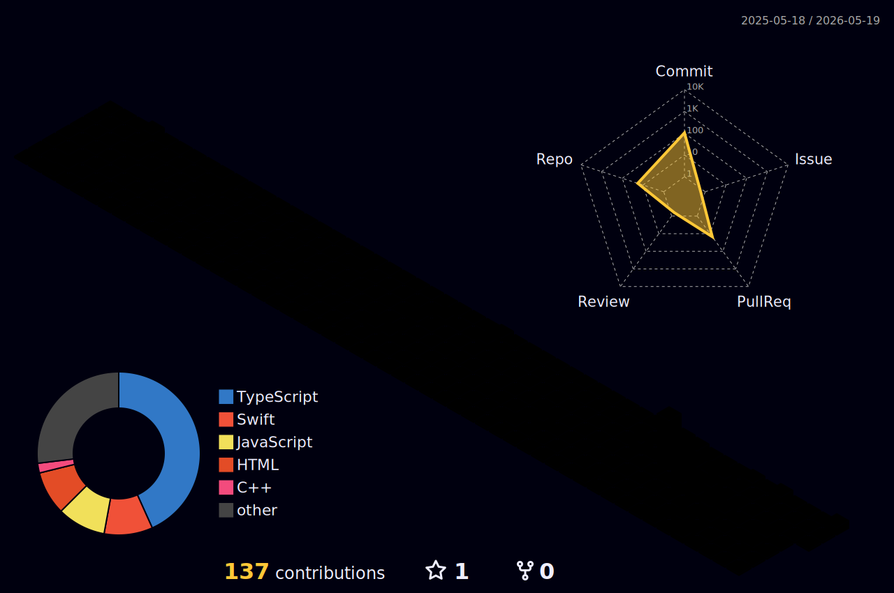

<h1 align="center">Привет, я Станислав 👋</h1>
<h3 align="center">Фронтенд-разработчик</h3>

  

---

### 🛠️ Мой стек технологий

  
  
  
  
  
  
  
  
  
  
  
  
  
  
  

---

### 📊 Статистика GitHub

  
  

  

  

---

### 🏆 Достижения

  

### 🌐 3D график активности

---

  

